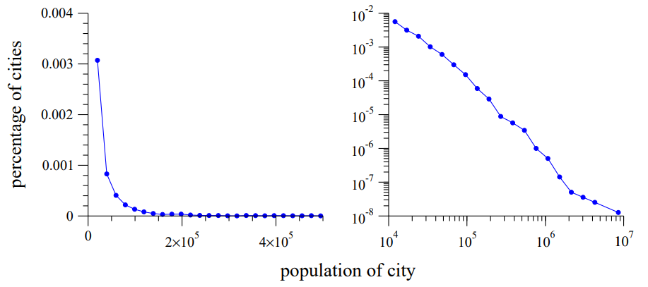

# Continuous Scale-Invariant Phenomena Can Be Described With Power Laws

Power laws are expressions like:

$$y = C x^{-\alpha}$$

where $y$ is like a probability density, and $x$ is the quantity we're interested in (like populations of cities, or the area affected by a bushfire, or the magnitudes of earthquakes).

<figure markdown="span">
    
    <figcaption>US cities with population of 10 000 or more from [1]</figcaption>
</figure>

This by itself wasn't mind-bending - I've used power laws before. But what **is** mind-bending is

!!! note "Power laws model scale-invariance, and are the only distribution that can"

For proof, see the section on Scale-free Distributions in [1].

Scale-invariance is a pretty neat concept. I think about it as observing the same patterns or behaviour whether or not you zoom in or out. Like with fractals! Which is what the forest fire, magnetic moment and sandpile demos look like in [2].

!!! note "Because Power Laws model scale-invariance, they model fractals"

They are also what power the Pareto principle, or the 80-20 rule. In fact, a "Pareto distribution" is just a power law distribution - they're the same thing up to the $\alpha$ parameter.

## References

1. [M. E. J. Newman 2006: Power laws, Pareto distributions and Zipf's law](https://arxiv.org/pdf/cond-mat/0412004)
2. [This Veritasium video from 27 Nov 2025 that appears to have different titles for different people](https://www.youtube.com/watch?v=HBluLfX2F_k)